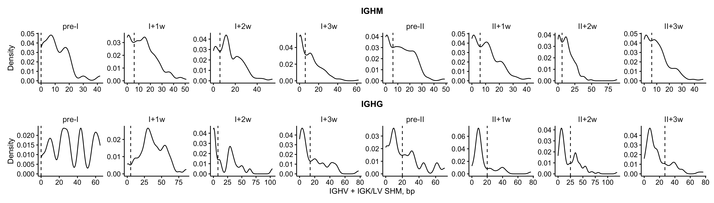
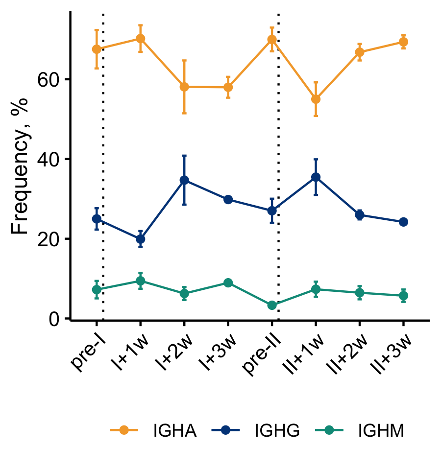

Analysis of transcriptome and Ig repertoire from B cels responding to
SARS-CoV-2 vaccination
================
Anna Obraztsova
07 June, 2024

``` r
library(dplyr)
library(tidyr)
library(stringr)
library(data.table)
library(forecast)

library(Seurat) # v4.3.0
library(AUCell)
library(destiny)
library(slingshot)

library(ggplot2)
library(ggforce)
library(ggthemes)
library(ggbeeswarm)
library(ggsignif)
library(ggrepel)

library(patchwork)
library(latex2exp)
library(pheatmap)
library(RColorBrewer)

count = dplyr::count

theme_basic <- function(){
  # Plotting theme for ggplots
  theme_classic() + 
    theme(strip.background = element_blank(),
          strip.text = element_text(size = 10),
          axis.text = element_text(size = 10, color = "black"),
          panel.grid.minor = element_blank(),
          axis.ticks = element_line(color = "black"),
          plot.title = element_text(size = 11, hjust = 0.5))
}

theme_basic_45 <- function(){
  # Plotting theme for ggplots with rotated x-axis labels
  theme_classic() + 
    theme(strip.background = element_blank(),
          strip.text = element_text(size = 10),
          axis.text = element_text(size = 10, color = "black"),
          axis.text.x = element_text(angle = 45, hjust = 1, vjust = 1),
          panel.grid.minor = element_blank(),
          axis.ticks = element_line(color = "black"),
          plot.title = element_text(size = 11, hjust = 0.5))
}

shannon_wiener <- function(clone_id_vec){
  # Normalized Shannon-Wiener calculation
  p <- table(clone_id_vec)/length(clone_id_vec)
  -sum(p * log(p)) / log(length(p))
}

bootstrap_sw <- function(clones, R, sample_size){
  # Repeat Shannon-Wiener calculation R times, return average and quantiles
  boot_exp <- lapply(1:R, function(x) clones %>% 
                       sample_n(sample_size) %>% 
                       mutate(iter = x)) %>%
    rbindlist() %>%
    group_by(iter) %>%
    summarise(sw = shannon_wiener(clone_id)) %>%
    ungroup
  
  sw = boot_exp$sw[!(is.na(boot_exp$sw)) & !(is.nan(boot_exp$sw))]
  
  data.table(sw = mean(sw), 
             ci_up = quantile(sw, probs = 0.95, na.rm = T), 
             ci_down = quantile(sw, probs = 0.05, na.rm = T))
}
```

Reads were mapped to human genome (GRCh38-2020-A) using 10x Genomics
Cell Ranger v6.1.2 multi. Cell filtering and read count normalization
was done using preprocess_transcriptome.R. Full-length V(D)J contigs
assembled with Cell Ranger were aligned to the IMGT reference using
IgBLAST v1.20.0. Filtering Ig repertoire data and clone definition was
done using preprocess_repertoire.R.

``` r
# Load transcriptome data
bcell_seu <- readRDS("data/bcell_seu_filtered.Rds")
cell_metadata <- bcell_seu@meta.data %>%
  mutate(timepoint = factor(timepoint, levels = c("pre-I", "I+1w", "I+2w", "I+3w",
                                                  "pre-II", "II+1w", "II+2w", "II+3w")),
         # Populations were defined by checking marker gene expression among the clusters
         population = recode(SCT_snn_res.0.15, 
                             `0` = "MBC",
                             `1` = "ASC",
                             `2` = "Naïve",
                             `3` = "MBC",
                             `4` = "ASC",
                             `5` = "ASC",
                             `6` = "ASC"),
         population = factor(population, levels = c("Naïve", "MBC", "ASC")),
         binding2 = ifelse(binding != "DN", "S+", "S-"))
rownames(cell_metadata) <- cell_metadata$barcode
bcell_seu <- AddMetaData(bcell_seu, cell_metadata %>% select(population, timepoint, binding2))

# Manually set thresholds for low- and high-SHM cells
threshold <- fread("data/high_SHM_thresholds.csv") %>%
  transmute(threshold = shm, isotype_short, timepoint)

# Load Ig repertoire data
ig_data = fread("data/vdj_paired.csv") %>%
  merge(readRDS("data/cell_metadata_filtered.Rds") %>%
          select(sample, barcode, population, Spike_status, RBD_status, binding2),
        by = c("sample", "barcode")) %>% 
  mutate(population2 = paste(population, binding2),
         heavy_shm = heavy_v_shm,
         light_shm = light_v_shm,
         shm = heavy_shm + light_shm) %>%
  merge(threshold, all.x = T, by = c("timepoint", "isotype_short")) %>%
  mutate(group = ifelse(shm >= threshold, "high-SHM", "low-SHM"),
         timepoint = factor(timepoint, levels = c("pre-I", "I+1w", "I+2w", "I+3w", "pre-II", "II+1w", "II+2w", "II+3w")))
ig_data[!(ig_data$population2 %in% c("MBC S+", "ASC S+", "ASC S-")) | !(ig_data$isotype_short %in% c("IGHM", "IGHG")), ]$group <- NA
ig_data <- ig_data %>%
  group_by(clone_id) %>%
  mutate(clone_has_high_SHM_MBC = ifelse("high-SHM" %in% group, T, F)) %>%
  ungroup

ig_data2 <- ig_data %>% 
  filter(isotype_short %in% c("IGHM", "IGHG"),
         population2 == "MBC S+")

cell_metadata <- cell_metadata %>%
  merge(ig_data %>%
          select(sample, barcode, clone_size, heavy_shm = heavy_v_shm, light_shm = light_v_shm, isotype = isotype_short), all.x = T,
        by = c("sample", "barcode")) %>%
  mutate(shm = light_shm + heavy_shm)
```

# Figure 1: Longitudinal characterization of early B cell response against SARS-CoV-2 mRNA vaccination

## Figure 1D

UMAP projection of single cell transcriptional profiles colored by
population.

``` r
pop_colors = c("#0077bb", "#F4A582", "#D6604D")
names(pop_colors) <- c("ASC", "Naïve", "MBC")

labels = data.frame(label = c("ASC", "Naïve", "MBC"),
                    UMAP_1 = c(-7.5,  5, 4.5),
                    UMAP_2 = c(-1.6,  -5, 2.2))

Idents(bcell_seu) <-"population"
DimPlot(bcell_seu, reduction = "umap", label = F,
        pt.size = 0.4, shuffle = T) &
  coord_equal() &
  scale_color_manual(values = pop_colors) &
  geom_text(data = labels, size = 4.5,
            aes(label = label, x = UMAP_1, y = UMAP_2), lineheight = 1) &
  geom_segment(aes(x = -12.2, y = -7.8, xend = -8.4, yend = -7.8), linewidth = 0.5,
               arrow = arrow(length = unit(0.15, "cm"), angle = 30, type = "closed")) &
  geom_segment(aes(x = -12.2, y = -7.8, xend = -12.2, yend = -4), linewidth = 0.5, lineend = 'butt',
               arrow = arrow(length = unit(0.15, "cm"), angle = 30, type = "closed")) &
  labs(x = "UMAP-1", y = "UMAP-2") &
  scale_x_continuous(limits = c(-12.5, 8), expand = c(0,0)) &
  scale_y_continuous(limits = c(-8.1, 8), expand = c(0,0)) &
  theme(axis.ticks = element_blank(),
        axis.text = element_blank(),
        axis.title = element_text(hjust = 0),
        axis.line = element_blank()) &
  guides(color = "none")
```


## Figure 1E

Expression profile of selected marker genes.

``` r
markers <- c("MS4A1", "CD19", "PTPRC", "CD38", "XBP1", "MZB1", "JCHAIN", "IRF4", "PRDM1", "IGHV", "CD27", "ZBTB32",  "CD86", "TCL1A", "FCER2")
p <- DotPlot(bcell_seu, features = markers) &
  scale_color_distiller(palette = "Greys", direction = 1, breaks = c(-1,0,1)) &
  labs(x = "", y = "") &
  theme(legend.text = element_text(size = 9),
        legend.title = element_text(size = 10),
        legend.key.height = unit(0.3, "cm"),
        legend.key.size = unit(0.3, "cm"),
        legend.position = "right",
        legend.direction = "vertical",
        axis.text.x = element_text(angle = 90, vjust = 0.5, hjust = 1, face = "italic"),
        axis.text.y = element_text(angle = 45, hjust = 1, vjust = 0.5, lineheight = 0.7)) &
  guides(color = guide_colorbar(title = 'Average\nExpression', ticks = F),
         size = guide_legend(title = "% Cells"))

plot_spacer() + p + plot_spacer() + plot_layout(height = c(2, 3, 0.8))
```


## Figure 1F-H

IGHV+IGK/LV somatic hypermutation (SHM) counts across the cell
populations, class-switched antibody frequency, and clone size
distribution.

``` r
p1 <- cell_metadata %>%
  filter(heavy_shm < 80) %>%
  ggplot(aes(x = population, y = heavy_shm, fill = population)) +
  geom_violin(scale = "width", draw_quantiles = 0.5) +
  theme_basic() +
  labs(x = "", y = "SHM (bp)") +
  scale_fill_manual(values = pop_colors, name = "") +
  guides(fill = "none") +
  scale_y_continuous(expand = c(0.01, 0.01))

p2 <- cell_metadata %>%
  filter(!is.na(clone_size)) %>%
  mutate(clone_size = cut(clone_size, c(0,1,5,1000), c("1", "2-5", ">5")),
         clone_size = factor(clone_size, levels = c("1", "2-5", ">5"))) %>%
  count(population, clone_size, name = "count", .drop = F) %>%
  add_count(population, wt = count, name = "tot") %>%
  ggplot(aes(x = population, y = 100 * count / tot, fill = clone_size)) +
  geom_col() +
  theme_basic() +
  theme(legend.key.size = unit(0.5, "cm")) +
  labs(x = "", y = "Frequency (%)") +
  scale_fill_manual(values = brewer.pal(9, "Greys")[c(2,5,8)], name = "Clone\nsize") +
  scale_y_continuous(expand = c(0.0, 0.0))

p3 <- cell_metadata %>%
  filter(!is.na(isotype), isotype != "") %>%
  mutate(isotype = ifelse(isotype %in% c("IGHM", "IGHD"), "non-switched", "switched")) %>%
  count(population, donor_id, isotype, name = "count", .drop = F) %>%
  add_count(population, donor_id, wt = count, name = "tot") %>%
  filter(isotype == "switched") %>%
  mutate(f = 100 * count / tot) %>%
  group_by(population) %>%
  summarise(f_sd = sd(f),
            f = mean(f)) %>%
  ungroup %>%
  ggplot(aes(x = population, y = f, fill = population)) +
  geom_errorbar(aes(ymin = f-f_sd, ymax = f + f_sd), width = 0.3, linewidth = 0.5) +
  geom_col() +
  theme_basic() +
  labs(x = "", y = "Class-switched (%)") +
  scale_y_continuous(expand = c(0,0), limits = c(0, 100)) +
  scale_fill_manual(values = pop_colors, name = "") +
  guides(fill = "none")

p1 + plot_spacer() + p3 + plot_spacer() + p2 + plot_layout(nrow = 1, width = c(6, 1, 6, 1, 6))
```


## Figure K-L

Frequency of antibody secreting and B cell populations in S+ cells over
time.

``` r
pop_freq <- cell_metadata %>%
  filter(binding == "DP") %>%
  mutate(donor_id = as.factor(donor_id)) %>%
  count(timepoint, population, donor_id, name = "count", .drop = F) %>%
  add_count(timepoint, donor_id, wt = count, name = "tot") %>%
  filter(tot != 0) %>%
  mutate(f = 100 * count/tot) %>%
  group_by(population, timepoint) %>%
  summarise(f_se = sd(f)/sqrt(n()),
            f = mean(f)) %>%
  ungroup

p1 <- pop_freq %>%
  filter(population %in% c("Naïve", "MBC")) %>%
  ggplot(aes(x = timepoint, y = f, color = population, group = population)) +
  geom_vline(data = data.frame(timepoint = c("pre-I", "pre-II")),
             aes(xintercept =  stage(timepoint, after_scale = c(1.15, 5.15))), linetype = "dotted") +
  geom_point() +
  geom_line() +
  geom_errorbar(aes(ymin = f-f_se, ymax = f+f_se), width = 0.2) +
  theme_basic_45() +
  labs(x = "", y = "% of S+") +
  scale_color_manual(values = pop_colors, name = "") +
  scale_y_continuous(expand = c(0,0), limits = c(30, 70), breaks = seq(30, 70, 10))

p2 <- pop_freq %>%
  filter(!population %in% c("Naïve", "MBC")) %>%
  ggplot(aes(x = timepoint, y = f, color = population, group = population)) +
  geom_vline(data = data.frame(timepoint = c("pre-I", "pre-II")),
             aes(xintercept =  stage(timepoint, after_scale = c(1.15, 5.15))), linetype = "dotted") +
  geom_point() +
  geom_line() +
  geom_errorbar(aes(ymin = f-f_se, ymax = f+f_se), width = 0.2) +
  theme_basic_45() +
  labs(x = "", y = "% of S+") +
  scale_color_manual(values = pop_colors, name = "") +
  scale_y_continuous(expand = c(0,0), limits = c(-0.01, 9), breaks = seq(0,9,3))

p2 + p1 + plot_layout(guides = "collect")
```


# Figure S1: Humoral and B cell anti-S response.

## Figure S1F

UMAP projection colored by sampling time point.

``` r
Idents(bcell_seu) <-"timepoint"
DimPlot(bcell_seu, reduction = "umap", label = F,
        pt.size = 0.4, shuffle = T) &
  coord_equal() &
  scale_color_ptol() &
  geom_segment(aes(x = -12.2, y = -7.8, xend = -8.4, yend = -7.8), linewidth = 0.5,
               arrow = arrow(length = unit(0.15, "cm"), angle = 30, type = "closed")) &
  geom_segment(aes(x = -12.2, y = -7.8, xend = -12.2, yend = -4), linewidth = 0.5, lineend = 'butt',
               arrow = arrow(length = unit(0.15, "cm"), angle = 30, type = "closed")) &
  labs(x = "UMAP-1", y = "UMAP-2") &
  scale_x_continuous(limits = c(-12.5, 8), expand = c(0,0)) &
  scale_y_continuous(limits = c(-8.1, 8), expand = c(0,0)) &
  theme(axis.ticks = element_blank(),
        axis.text = element_blank(),
        axis.title = element_text(hjust = 0),
        axis.line = element_blank())
```


## Figure S1G

Frequency of persistent clones. Dots show average and error bars SEM
across donors.

``` r
calc_persistent <- function(tp){
  ig_data %>%
    group_by(clone_id, donor_id) %>%
    summarise(has_S = "S+" %in% binding2,
              has_tp = tp %in% timepoint,
              timepoints = paste(sort(unique(timepoint)), collapse = ",")) %>%
    ungroup %>%
    filter(has_S, has_tp) %>%
    mutate(persistent = as.factor(ifelse(timepoints == tp, "non-persistent", "persistent"))) %>%
    count(persistent, donor_id, .drop = F) %>%
    mutate(timepoint = tp)
}

persist_freq <- lapply(unique(ig_data$timepoint), calc_persistent) %>%
  rbindlist
```

``` r
persist_freq %>%
  add_count(donor_id, timepoint, wt = n, name = "tot") %>%
  mutate(f = 100*n/tot) %>%
  filter(persistent == "persistent") %>%
  group_by(timepoint) %>%
  summarise(f_mean = mean(f),
            f_se = sd(f)/sqrt(n())) %>%
  ungroup() %>%
  ggplot(aes(x = timepoint, y = f_mean)) +
  geom_point() +
  geom_errorbar(aes(ymin = f_mean - f_se, ymax = f_mean + f_se), width = 0.2) +
  theme_basic_45() +
  labs(x = "", y = "Persistent clones (%)") +
  scale_y_continuous(expand = c(0,0)) +
  coord_cartesian(ylim = c(5,20), clip = "off")
```


## Figure S1H

Frequency of TFRC+ among MBCs and naïve B cells. TFRC+ cell were defined
by presence of at least one TFRC transcript. Dotted vertical lines
indicate prime and boost.

# Figure 2: Low-SHM but not high-SHM S+ IgG MBCs display signs of ongoing GC reaction

## Figure 2A

IGHV + IGK/LV SHM counts in S+ IgG MBCs. Dotted vertical lines indicate
prime and boost.

``` r
group_colors = c(`baseline` = "white", `high-SHM` = "white", `low-SHM` = "black")
group_symb = c(`baseline` = 2, `high-SHM` = 21, `low-SHM` = 21)

ig_data %>%
  filter(isotype_short %in% c("IGHG"),
         population2 == "MBC S+", shm < 100) %>%
  mutate(group = ifelse(timepoint == "pre-I", "baseline", group),
         timepoint = as.integer(timepoint),
         shm = heavy_shm + light_shm) %>%
  ggplot(aes(x = timepoint, y = shm)) +
  geom_quasirandom(aes(shape = group, group = timepoint, fill = group), size = 1.5, width=0.3) +
  geom_vline(data = data.frame(timepoint = c("pre-I", "pre-II")),
             aes(xintercept = c(1.5, 5.5)),
             linetype = "dotted") +
  geom_segment(data = threshold %>%
                 filter(isotype_short == "IGHG", timepoint != "pre-I") %>%
                 mutate(timepoint = factor(timepoint, levels = levels(ig_data$timepoint)),
                        timepoint = as.integer(timepoint),
                        shm = threshold),
               aes(y = shm, yend = shm, x = timepoint - 0.45, xend = timepoint + 0.45),
               color = "#c21919", linewidth = 0.8) +
  theme_basic() +
  labs(x = "", y = "SHM (bp)") +
  theme(strip.text = element_text(size = 11),
        axis.title.x = element_blank(),
        legend.margin = margin(0, 0, 0, 0),
        legend.box.margin = margin(-10, 10, -10, -10)) +
  scale_y_continuous(breaks = seq(0,90,30), limits = c(0,90), expand = c(0.04, 0.04)) +
  scale_x_continuous(breaks = 1:8, labels = levels(ig_data$timepoint)) +
  scale_shape_manual(values = group_symb, name = "S+ IgG MBC") +
  scale_fill_manual(values = group_colors, name = "S+ IgG MBC") +
  guides(shape = guide_legend(override.aes = list(size=2)))
```


## Figure 2B

Frequency of low- and high-SHM MBCs over time.

``` r
group_freq <- ig_data2 %>%
  mutate(donor_id = as.factor(donor_id),
         group = as.factor(group),
         isotype_short = as.factor(isotype_short)) %>%
  count(timepoint, donor_id, group, isotype_short, name = "count", .drop = F) %>%
  add_count(timepoint, donor_id, isotype_short, wt = count, name = "tot") %>%
  mutate(freq = 100*count/tot,
         timepoint = factor(timepoint, levels = c("pre-I", "I+1w", "I+2w", "I+3w", "pre-II", "II+1w", "II+2w", "II+3w"))) %>%
  group_by(timepoint, isotype_short, group) %>%
  summarise(freq_se = sd(freq, na.rm = T)/sqrt(n()),
            freq = mean(freq, na.rm = T)) %>%
  ungroup

group_freq %>%
  filter(timepoint != "pre-I", isotype_short == "IGHG") %>%
  ggplot(aes(x = timepoint, y = freq, fill = group, group = group)) +
  geom_vline(data = data.frame(timepoint = c("I+1w", "II+1w")),
             aes(xintercept =  stage(timepoint, after_scale = c(0.7, 4.5))),
             linetype = "dotted") +
  geom_errorbar(aes(ymin = freq-freq_se, ymax = freq+freq_se),
                width = 0.15) +
  geom_line() +
  geom_point(shape = 21, size = 2) +
  labs(x = "", y = "Frequency (%)") +
  theme_basic_45() +
  scale_fill_manual(values = group_colors, name = "") +
  scale_y_continuous(limits = c(0, 100)) +
  theme(axis.title.x = element_blank(),
        strip.text = element_text(size = 11),
        aspect.ratio = 0.75) +
  guides(fill = "none")
```


## Figure 2C

Average SHM count over time.

``` r
average_shm <- ig_data2 %>%
  group_by(timepoint, group, donor_id, isotype_short) %>%
  summarise(shm = mean(heavy_shm + light_shm)) %>%
  ungroup %>%
  group_by(timepoint, group, isotype_short) %>%
  summarise(shm_se = sd(shm, na.rm = T)/sqrt(n()),
            shm = mean(shm, na.rm = T)) %>%
  ungroup

average_shm %>%
  filter(timepoint != "pre-I", isotype_short == "IGHG") %>%
  ggplot(aes(x = timepoint, y = shm,
             fill = group, group = group,
             linetype = isotype_short)) +
  geom_vline(data = data.frame(timepoint = c("I+1w", "II+2w")),
             aes(xintercept =  stage(timepoint, after_scale = c(0.7, 4.5))), linetype = "dotted") +
  geom_errorbar(aes(ymin = shm-shm_se, ymax = shm+shm_se),
                width=0.1, size = 0.5) +
  geom_line() +
  geom_point(shape = 21, size = 2) +
  labs(x = "", y = "Average SHM (bp)") +
  theme_basic_45() +
  scale_fill_manual(values = group_colors, name = "") +
  scale_y_continuous(limits = c(0,60)) +
  scale_linetype_manual(values = c("solid", "dashed"), name = "") +
  theme(axis.title.x = element_blank(),
        strip.text = element_text(size = 11)) +
  guides(linetype = "none", fill = "none")
```


Compare the average SHM numbers before the vaccination and at I+1w

``` r
ig_data2 %>%
  filter(timepoint %in% c("pre-I", "I+1w"), group == "high-SHM", isotype_short == "IGHG") %>%
  group_by(timepoint) %>%
  summarise(mean_SHM = mean(shm))
```

    ## # A tibble: 2 × 2
    ##   timepoint mean_SHM
    ##   <fct>        <dbl>
    ## 1 pre-I         33.5
    ## 2 I+1w          38.5

``` r
wilcox.test(filter(ig_data2, group == "high-SHM", isotype_short == "IGHG", timepoint == "pre-I")$shm,
            filter(ig_data2, group == "high-SHM", isotype_short == "IGHG", timepoint == "I+1w")$shm)
```

    ## 
    ##  Wilcoxon rank sum test with continuity correction
    ## 
    ## data:  filter(ig_data2, group == "high-SHM", isotype_short == "IGHG", timepoint == "pre-I")$shm and filter(ig_data2, group == "high-SHM", isotype_short == "IGHG", timepoint == "I+1w")$shm
    ## W = 691.5, p-value = 0.3573
    ## alternative hypothesis: true location shift is not equal to 0

## Figure 2D

Clonal expansion of low- and high-SHM MBCs.

``` r
# Calculate clonal frequencies
x <- ig_data2 %>%
  add_count(clone_id, donor_id, name = "clone_size") %>%
  mutate(clone_id = ifelse(clone_size == 1, "0", clone_id)) %>%
  count(donor_id, group, clone_id, name = "count") %>%
  add_count(donor_id, group, wt = count, name = "tot") %>%
  mutate(freq = count/tot)

# Generate unique color for each clone
pal <- colorRampPalette(brewer.pal(11, "Spectral"))
n_col = length(unique(x$clone_id))-1
clone_colors <- c("white", sample(pal(n_col), n_col))

x %>%
  ggplot(aes(x = donor_id, y = 100 * freq)) +
  geom_col(aes(fill = clone_id), color = "black", size = 0.3, alpha = 0.8) +
  geom_text(data = x %>% select(donor_id, group, tot) %>% unique %>%
              mutate(freq = 1.05),
            aes(label = tot), size = 3, ) +
  labs(x = "", y = "Frequency of cells, %") +
  facet_grid(~group, scales = "free_x") +
  theme_basic() +
  scale_fill_manual(values = clone_colors) +
  theme(legend.position = "none",
        axis.title.x = element_blank(),
        strip.text = element_text(size = 11),
        strip.text.y = element_text(angle = 0, size = 11)) +
  scale_y_continuous(expand = c(0, 0), limits = c(0, 110))
```


## Figure 2E

Clonal diversity. Each dot represents one donor.

``` r
group_list <- ig_data2 %>%
  count(donor_id, group)

# Bootstrap Shannon-Wiener
N = 70
N_iter = 100
sw_stats <- lapply(1:nrow(group_list), function(x) bootstrap_sw(ig_data2 %>%
                                                                  filter(donor_id == group_list$donor_id[x],
                                                                         group == group_list$group[x]),
                                                                R = N_iter,
                                                                sample_size = N) %>%
                     mutate(donor_id = group_list$donor_id[x],
                            group = group_list$group[x])) %>%
  rbindlist()

group_colors2 = c(`high-\nSHM` = "white", `low-\nSHM` = "black")

sw_stats %>%
  mutate(group = str_replace(group, "-", "-\n")) %>%
  ggplot(aes(x = group, y = sw)) +
  geom_quasirandom(aes(fill = group, group = group), width = 0.2, shape = 21, size = 2) +
  stat_summary(fun = mean, color = "black", geom = "crossbar", size = 0.3) +
  geom_signif(comparisons = list(c("high-\nSHM", "low-\nSHM")),
              map_signif_level = T, size = 0.4, textsize = 3.5, y_position = 1, tip_length = 0) +
  theme_basic() +
  labs(x = "", y = "Normalized\nShannon-Wiener index") +
  scale_fill_manual(values = group_colors2) +
  scale_y_continuous(breaks = c(0.99, 0.995, 1), limits = c(0.988, 1.001)) +
  guides(fill = "none")
```


Count shared clones between low- and high-SHM

``` r
ig_data %>%
  filter(binding2 == "S+") %>%
  group_by(clone_id) %>%
  summarise(groups = paste(sort(unique(group)), collapse = ","),
            n = n()) %>%
  ungroup %>%
  filter(n>1) %>%
  count(groups)
```

    ## # A tibble: 4 × 2
    ##   groups                 n
    ##   <chr>              <int>
    ## 1 ""                    15
    ## 2 "high-SHM"            58
    ## 3 "high-SHM,low-SHM"     7
    ## 4 "low-SHM"             16

## Figure 2F-H

UMAP projection of high- and low-SHM S+ IgG MBCs colored by SHM level or
cluster defined by unsupervised transcriptome clustering. Frequency of
high- and low-SHM cells in the transcriptome clusters.

``` r
# Subset Seurat object to IgG MBCs and re-analyze data
memory_IgG <- ig_data2 %>%
  filter(isotype_short == "IGHG") %>%
  as.data.frame
rownames(memory_IgG) <- memory_IgG$barcode

mem_IgG <- subset(bcell_seu, cells = memory_IgG$barcode)
mem_IgG <- AddMetaData(mem_IgG, memory_IgG %>% select(shm, isotype = isotype_short, group))

set.seed(1)
mem_IgG <- mem_IgG %>%
  RunPCA(npcs = 30, verbose = F) %>%
  RunUMAP(reduction = "pca", dims = 1:30, verbose = F) %>%
  RunTSNE(reduction = "pca", dims = 1:30, verbose = F) %>%
  FindNeighbors(reduction = "pca", dims = 1:30, verbose = F) %>%
  FindClusters(resolution = 0.4, verbose = F)

# Note: the assignment of cluster IDs could change, check the cluster number and modify if needed!
mem_IgG$cluster <- ifelse(mem_IgG$seurat_clusters == "1", "high-SHM\nassociated", "low-SHM\nassociated")
```

``` r
group_colors = c(`high-SHM` = "white", `low-SHM` = "black")

embeds = Embeddings(mem_IgG[["umap"]]) %>%
  as.data.frame() %>%
  mutate(barcode = rownames(Embeddings(mem_IgG[["umap"]]))) %>%
  merge(mem_IgG@meta.data)

cluster_cols = c(`high-SHM\nassociated` = "#D95F02", `low-SHM\nassociated` = "#1B9E77")

p1 <- embeds %>%
  ggplot(aes(x = -UMAP_2, y = UMAP_1)) +
  geom_point(aes(color = cluster), size = 1) +
  theme_basic() +
  geom_segment(aes(x = -3, y = -4.7, xend = -1, yend = -4.7), linewidth = 0.5,
               arrow = arrow(length = unit(0.15, "cm"), angle = 30, type = "closed")) +
  geom_segment(aes(x = -3, y = -4.7, xend = -3, yend = -2.7), linewidth = 0.5, lineend = 'butt',
               arrow = arrow(length = unit(0.15, "cm"), angle = 30, type = "closed")) +
  labs(x = "UMAP-1", y = "UMAP-2") +
  theme(axis.ticks = element_blank(),
        axis.text = element_blank(),
        axis.line = element_blank(),
        axis.title = element_text(hjust = 0)) +
  scale_color_manual(name = "Cluster", values = cluster_cols) +
  coord_equal() +
  theme(legend.position = "bottom",
        legend.direction = "vertical",
        legend.key.size = unit(0.8, "cm")) +
  guides(color = guide_legend(override.aes = list(size=3)))

p2 <- embeds %>%
  ggplot(aes(x = -UMAP_2, y = UMAP_1)) +
  geom_point(aes(fill = group), size = 1.5, shape  =21) +
  theme_basic() +
  geom_segment(aes(x = -3, y = -4.7, xend = -1, yend = -4.7), linewidth = 0.5,
               arrow = arrow(length = unit(0.15, "cm"), angle = 30, type = "closed")) +
  geom_segment(aes(x = -3, y = -4.7, xend = -3, yend = -2.7), linewidth = 0.5, lineend = 'butt',
               arrow = arrow(length = unit(0.15, "cm"), angle = 30, type = "closed")) +
  labs(x = "UMAP-1", y = "UMAP-2") +
  theme(axis.ticks = element_blank(),
        axis.text = element_blank(),
        axis.line = element_blank(),
        axis.title = element_text(hjust = 0)) +
  scale_fill_manual(values = group_colors, name = "MBC") +
  coord_equal() +
  theme(legend.position = "bottom",
        legend.direction = "vertical") +
  guides(fill = guide_legend(override.aes = list(size=3)))

x <- mem_IgG@meta.data %>%
  count(group, cluster, name = "count") %>%
  add_count(cluster, wt = count, name = "tot")

mat <- matrix(x$count, ncol = 2)
p <- chisq.test(mat)$p.value
sign = case_when(p <= 0.0001 ~ "****",
                 p <= 0.001 ~ "***",
                 p <= 0.01 ~ "**",
                 p <= 0.05 ~ "*",
                 TRUE ~ "")

p3 <- x %>%
  ggplot(aes(x = cluster, y = 100*count/tot, fill = group)) +
  geom_col(color = "black", linewidth = 0.3) +
  geom_segment(x = 0.9, xend = 2.1, y = 104, yend = 104, color = "black", linewidth = 0.4) +
  annotate(geom = "text", label = sign, size = 5, y = 105, x = 1.5) +
  theme_basic_45() +
  labs(x = "Cluster", y = "Frequency, %") +
  scale_fill_manual(values = group_colors, name = "") +
  scale_y_continuous(expand = c(0,0), limits = c(0, 110)) +
  theme(legend.key.size = unit(0.5, "cm"),
        axis.text.x = element_text(lineheight = 0.8))

p2 + p1 + p3 + plot_layout(width = c(2, 2, 1))
```


## Figure 2I

Genes differentially expressed between low- and high-SHM associated
clusters

``` r
Idents(mem_IgG) <- "cluster"
m <- FindMarkers(mem_IgG, ident.1 = "high-SHM\nassociated", ident.2 = "low-SHM\nassociated")

# Save list of DEG for analysis using IPA
# m %>%
#   mutate(name = rownames(m)) %>%
#   select(name, p_val_adj, avg_log2FC) %>%
#   write.table("tables/DEG_clusters_in_IgG_MBC.csv", sep = ",", row.names = F, col.names=F, quote = F)
```

``` r
log2FC_threshold = 0.35
p_threshold = 0.05

log2FC_threshold_high = 0.55
log2FC_threshold_low = -0.95

x <- m %>%
  mutate(name = rownames(m),
         enriched = case_when(p_val_adj < p_threshold & avg_log2FC > log2FC_threshold ~ "Up in high-SHM\nassociated",
                              p_val_adj < p_threshold & avg_log2FC < -log2FC_threshold ~ "Up in low-SHM\nassociated",
                              TRUE ~ "Unchanged"),
         label = case_when(p_val_adj < p_threshold & avg_log2FC > log2FC_threshold_high ~ name,
                           (p_val_adj < p_threshold & avg_log2FC < log2FC_threshold_low) | p_val_adj < 1e-15 ~ name,
                           TRUE ~ NA)) %>%
  group_by(enriched) %>%
  mutate(enriched = paste0(enriched, "\n(n = ", n(), ")")) %>%
  ungroup
groups = sort(unique(x$enriched))
x$enriched = factor(x$enriched, levels = c(groups[3], groups[1], groups[2]))

x %>%
  ggplot(aes(x = avg_log2FC, y = -log10(p_val_adj), label = label)) +
  geom_point(aes(color = enriched), size = 0.8) +
  geom_text_repel(size = 2, min.segment.length = 0.1, max.overlaps = Inf, nudge_y = 0.5, force = 1, segment.size = 0.3,
                  fontface = "italic") +
  geom_hline(yintercept = -log10(p_threshold), linetype = "dashed") +
  geom_vline(xintercept = c(log2FC_threshold, -log2FC_threshold), linetype = "dashed") +
  theme_basic() +
  theme(legend.spacing.y = unit(0.3, 'cm')) +
  labs(y = "-log10(P-value)", x = "log2(Fold Change)") +
  scale_x_continuous(limits = c(-1.8, 1.8)) +
  scale_color_manual(values = c("#1B9E77", "grey70", "#D95F02"),
                     name = "") +
  guides(color = guide_legend(byrow = TRUE, override.aes = list(size=2)))
```


## Figure 2J

Signalling pathways and transcriptional programs enriched in genes
differentially expressed between low- and high-SHM associated clusters.

Signaling pathways

``` r
exclude_list = c("Fcγ Receptor-mediated Phagocytosis in Macrophages and Monocytes",
                 "Epithelial Adherens Junction Signaling",
                 "Role of Osteoclasts in Rheumatoid Arthritis Signaling Pathway",
                 "Systemic Lupus Erythematosus in B Cell Signaling Pathway",
                 "CD28 Signaling in T Helper Cells",
                 "Remodeling of Epithelial Adherens Junctions",
                 "Sertoli Cell Germ Cell Junction Signaling Pathway (Enhanced)",
                 "Wound Healing Signaling Pathway",
                 "Paxillin Signaling", "Oncostatin M Signaling",
                 "Macrophage Alternative Activation Signaling Pathway",
                 "PD-1, PD-L1 cancer immunotherapy pathway", "CTLA4 Signaling in Cytotoxic T Lymphocytes",
                 "MSP-RON Signaling in Macrophages Pathway")

pathways_1 <- fread("data/IPA_results/pathways.txt") %>%
  select(-V6)
colnames(pathways_1) <- unlist(pathways_1[1, ])
pathways_1 <- pathways_1[2:nrow(pathways_1), ]
pathways_1 <- pathways_1 %>%
  mutate(p = 10**(-as.numeric(str_replace(`-log(p-value)`, ",", "\\."))),
         Z = as.numeric(str_replace(`z-score`, ",", "\\.")),
         name = `Ingenuity Canonical Pathways`) %>%
  filter(!is.nan(Z), !name %in% exclude_list) %>%
  mutate(p.adj = p.adjust(p, method = "BH"))

pathways_1 <- pathways_1 %>%
  filter(p < 0.05, (Z > 2 | Z < -2))
pathways_1$name <- factor(pathways_1$name, levels = pathways_1 %>% arrange(Z) %>% .$name)

ipa_cols = cluster_cols
names(ipa_cols) <- c("Up", "Down")

p1 <- pathways_1 %>%
  mutate(group = ifelse(Z > 0, "Up", "Down"),
         label = case_when(p.adj <= 0.0001 ~ "****",
                           p.adj <= 0.001 ~ "***",
                           p.adj <= 0.01 ~ "**",
                           p.adj <= 0.05 ~ "*",
                           TRUE ~ ""),
         position = Z + 0.8*sign(Z)) %>%
  ggplot(aes(y = name, fill = group, label = label)) +
  geom_col(aes(x = Z)) +
  geom_text(aes(x = position), nudge_y = -0.15) +
  labs(x = "Z-score", y = "", title = "Signaling pathways") +
  scale_fill_manual(values = ipa_cols) +
  theme_basic() +
  theme(axis.title.x = element_blank(),
        plot.title = element_text(face = "bold", hjust = 0)) +
  guides(fill = "none") +
  scale_x_continuous(limits = c(-6.5, 4.5))
p1
```


Upstream regulators

``` r
pathways_2 <- fread("data/IPA_results/upstream_regulators_all.txt") %>%
  filter(`Molecule Type` %in% c("complex", "cytokine", "enzyme", "G-protein coupled receptor",
                                "group", "growth factor", "ion channel", "kinase", "ligand-dependent nuclear receptor",
                                "other", "peptidase", "transcription regulator", "transmembrane receptor", "transporter")) %>%
  mutate(p = as.numeric(str_replace(`p-value of overlap`, ",", "\\.")),
         p.adj = p.adjust(p, method = "BH"),
         Z = as.numeric(str_replace(`Activation z-score`, ",", "\\.")),
         name = `Upstream Regulator`)

pathways_2 <- pathways_2 %>%
  filter(p.adj < 0.05, !is.nan(Z), !is.na(Z),
         (Z > 2 | Z < -2))
pathways_2$name <- factor(pathways_2$name, levels = pathways_2 %>% arrange(Z) %>% .$name)

p2 <- pathways_2 %>%
  mutate(group = ifelse(Z > 0, "Up", "Down"),
         label = case_when(p.adj <= 0.0001 ~ "****",
                           p.adj <= 0.001 ~ "***",
                           p.adj <= 0.01 ~ "**",
                           p.adj <= 0.05 ~ "*",
                           TRUE ~ ""),
         position = Z + 0.3 * sign(Z)) %>%
  ggplot(aes(y = name, fill = group, label = label)) +
  geom_col(aes(x = Z)) +
  geom_text(aes(x = position), nudge_y = -0.2) +
  labs(x = "Z-score", y = "", title = "Upstream regulators") +
  scale_fill_manual(values = ipa_cols) +
  theme_basic() +
  theme(axis.title.x = element_blank(),
        plot.title = element_text(face = "bold", hjust = 0)) +
  guides(fill = "none") +
  scale_x_continuous(limits = c(-6.5, 4.5))
p2
```


Biological functions

``` r
pathways_3 <- fread("data/IPA_results/diseases_and_functions.txt") %>%
  mutate(p = as.numeric(str_replace(`p-value`, ",", "\\.")),
         Z = as.numeric(str_replace(`Activation z-score`, ",", "\\.")),
         name = `Diseases or Functions Annotation`,
         cat = str_split(Categories, ",")) %>%
  unnest(cols = cat) %>%
  # Filter out irrelevant pathways
  filter(cat %in% c("Cell Death and Survival",
                    "Cellular Growth and Proliferation", "Lymphoid Tissue Structure and Development",
                    "Humoral Immune Response",
                    "Cell-mediated Immune Response"),
         !str_detect(name, "macrophage|T lymphocyte|cell line|myeloid|Myelo|granulocyte|neutrophil|phagocyte|platelet|antigen presenting cell|astrocyte|osteoclast|vascular|endothelial|epithelial|embryonic|egakaryo|melnoma|glia|bone marrow|thymocyte|Myelin|Neur|neur|connective|stem cell|renal|monocyte|TREG|fibroblasts|leukocytes"),
         !is.nan(Z), !is.na(Z)) %>%
  group_by(name, p, Z, Molecules) %>%
  summarise(cat = paste(cat, collapse = ", ")) %>%
  ungroup %>%
  mutate(p.adj = p.adjust(p, method = "BH"))

pathways_3 <- pathways_3 %>%
  filter(p.adj < 0.05, (Z < -1 | Z > 1))
pathways_3$name <- factor(pathways_3$name, levels = pathways_3 %>% arrange(Z) %>% .$name)

p3 <- pathways_3 %>%
  mutate(group = ifelse(Z > 0, "Up", "Down"),
         label = case_when(p.adj <= 0.0001 ~ "****",
                           p.adj <= 0.001 ~ "***",
                           p.adj <= 0.01 ~ "**",
                           p.adj <= 0.05 ~ "*",
                           TRUE ~ ""),
         position = Z + 0.4 * sign(Z)) %>%
  ggplot(aes(y = name, fill = group, label = label)) +
  geom_col(aes(x = Z)) +
  geom_text(aes(x = position), nudge_y = -0.2) +
  labs(x = "Z-score", y = "", title = "Biological processes") +
  scale_fill_manual(values = ipa_cols) +
  scale_x_continuous(limits = c(-4.5, 4.5), breaks = c(-4,-2,0,2,4)) +
  theme_basic() +
  theme(plot.title = element_text(face = "bold", hjust = 0)) +
  guides(fill = "none") +
  scale_x_continuous(limits = c(-6.5, 4.5))

p3
```


# Figure S2: BCR repertoire analysis of high- and low-SHM S+ MBCs

## Figure S2A

SHM count distribution in IGHM and IGHG expressing S+ MBCs at the
indicated time points. Dashed lines show thresholds separating the first
density peak from the rest of the distribution.

``` r
p1 <- ig_data %>%
  filter(population2 %in% c("MBC S+"),
         isotype_short == "IGHM") %>%
  mutate(timepoint = factor(timepoint, levels = c("pre-I", "I+1w", "I+2w", "I+3w", "pre-II", "II+1w", "II+2w", "II+3w"))) %>%
  ggplot(aes(x = heavy_shm + light_shm)) +
  geom_density(bw = 2.5) +
  geom_vline(aes(xintercept = threshold), linetype = "dashed") +
  theme_basic() +
  facet_wrap(~timepoint, scales = "free", nrow = 1) +
  labs(y = "Density", title = "IGHM") +
  scale_fill_tableau() +
  theme(axis.title.x = element_blank(),
        plot.title = element_text(face = "bold", size = 12),
        strip.text = element_text(size = 11))

p2 <- ig_data %>%
  filter(population2 %in% c("MBC S+"),
         isotype_short == "IGHG") %>%
  mutate(timepoint = factor(timepoint, levels = c("pre-I", "I+1w", "I+2w", "I+3w", "pre-II", "II+1w", "II+2w", "II+3w"))) %>%
  ggplot(aes(x = heavy_shm + light_shm)) +
  geom_density(bw = 3) +
  geom_vline(aes(xintercept = threshold), linetype = "dashed") +
  theme_basic() +
  facet_wrap(~timepoint, scales = "free", nrow = 1) +
  labs(x = "IGHV + IGK/LV SHM, bp", y = "Density", title = "IGHG") +
  scale_fill_tableau() +
  theme(plot.title = element_text(face = "bold", size = 12),
        strip.text = element_text(size = 11))

p1 / p2
```



## Figure S2B

IGHV + IGK/LV SHM counts in IgM MBCs

``` r
ig_data %>%
  filter(isotype_short %in% c("IGHM"),
         population2 == "MBC S+", shm < 100) %>%
  mutate(group = ifelse(timepoint == "pre-I", "baseline", group),
         timepoint = as.integer(timepoint),
         shm = heavy_shm + light_shm) %>%
  ggplot(aes(x = timepoint, y = shm)) +
  geom_quasirandom(aes(shape = group, group = timepoint, fill = group), size = 1.5, width=0.3) +
  geom_vline(data = data.frame(timepoint = c("pre-I", "pre-II")),
             aes(xintercept = c(1.5, 5.5)),
             linetype = "dotted") +
  geom_segment(data = threshold %>%
                 filter(isotype_short == "IGHM", timepoint != "pre-I") %>%
                 mutate(timepoint = factor(timepoint, levels = levels(ig_data$timepoint)),
                        timepoint = as.integer(timepoint),
                        shm = threshold),
               aes(y = shm, yend = shm, x = timepoint - 0.45, xend = timepoint + 0.45),
               color = "#c21919", linewidth = 0.8) +
  theme_basic() +
  labs(x = "", y = "SHM (bp)") +
  theme(strip.text = element_text(size = 11),
        axis.title.x = element_blank(),
        legend.margin = margin(0, 0, 0, 0),
        legend.box.margin = margin(-10, 10, -10, -10)) +
  scale_y_continuous(breaks = seq(0,90,30), limits = c(0,90), expand = c(0.04, 0.04)) +
  scale_x_continuous(breaks = 1:8, labels = levels(ig_data$timepoint)) +
  scale_shape_manual(values = group_symb, name = "S+ IgM MBC") +
  scale_fill_manual(values = group_colors, name = "S+ IgM MBC") +
  guides(shape = guide_legend(override.aes = list(size=2)))
```


## Figure S2C

Average SHM counts in IgM MBCs over time

``` r
group_freq %>%
  filter(timepoint != "pre-I", isotype_short == "IGHM") %>%
  ggplot(aes(x = timepoint, y = freq, fill = group, group = group)) +
  geom_vline(data = data.frame(timepoint = c("I+1w", "II+1w")),
             aes(xintercept =  stage(timepoint, after_scale = c(0.7, 4.5))),
             linetype = "dotted") +
  geom_errorbar(aes(ymin = freq-freq_se, ymax = freq+freq_se),
                width = 0.15) +
  geom_line() +
  geom_point(shape = 21, size = 2) +
  labs(x = "", y = "Frequency (%)") +
  theme_basic_45() +
  scale_fill_manual(values = group_colors, name = "") +
  scale_y_continuous(limits = c(0, 100)) +
  theme(axis.title.x = element_blank(),
        strip.text = element_text(size = 11),
        aspect.ratio = 0.75) +
  guides(fill = "none")
```


## Figure S2D

Frequency of low- and high-SHM IgM MBC over time

``` r
average_shm %>%
  filter(timepoint != "pre-I", isotype_short == "IGHM") %>%
  ggplot(aes(x = timepoint, y = shm,
             fill = group, group = group,
             linetype = isotype_short)) +
  geom_vline(data = data.frame(timepoint = c("I+1w", "II+2w")),
             aes(xintercept =  stage(timepoint, after_scale = c(0.7, 4.5))), linetype = "dotted") +
  geom_errorbar(aes(ymin = shm-shm_se, ymax = shm+shm_se),
                width=0.1, size = 0.5) +
  geom_line() +
  geom_point(shape = 21, size = 2) +
  labs(x = "", y = "Average SHM (bp)") +
  theme_basic_45() +
  scale_fill_manual(values = group_colors, name = "") +
  scale_y_continuous(limits = c(0,60)) +
  scale_linetype_manual(values = c("solid", "dashed"), name = "") +
  theme(axis.title.x = element_blank(),
        strip.text = element_text(size = 11)) +
  guides(linetype = "none", fill = "none")
```


# Figure 3. Features associated with S-binding are enriched in antibodies of low-SHM S+ MBCs

## Figure 3A

Read counts of Spike and RBD tetramer barcodes in S+ IgG MBCs.

``` r
ig_data2 %>%
  select(group, isotype_short, Spike, RBD) %>%
  pivot_longer(!c(isotype_short, group), names_to = "Ag", values_to = "count") %>%
  mutate(Ag = factor(Ag, levels = c("Spike", "RBD"))) %>%
  filter(isotype_short == "IGHG") %>%
  mutate(group = str_replace(group, "-", "-\n")) %>%
  ggplot(aes(x = group, y = count)) +
  geom_violin(aes(fill = group), color = "black") +
  geom_signif(comparisons = list(c("high-\nSHM", "low-\nSHM")),
              map_signif_level = T, size = 0.4, textsize = 3.5, tip_length = 0) +
  stat_summary(geom = "crossbar", fun = mean, color = "#c21919", size = 0.6) +
  facet_wrap(~Ag) +
  labs(x = "", y = "Barcode read count") +
  theme_basic() +
  theme(plot.title = element_text(size = 12, face = "bold"),
        strip.text.x = element_text(size = 11)) +
  scale_fill_manual(values = group_colors2) +
  scale_y_log10(limits = c(1, 2000)) +
  guides(fill = "none")
```


## Figure 3B

BCR signaling pathway gene expression in S+ IgG MBCs. (C-F) Ig variable
segment gene usage of S+ MBCs.

``` r
# Calculate cell rankings
counts <- GetAssayData(object = mem_IgG, slot = "counts")
cell_ranks <- AUCell_buildRankings(as.matrix(counts), plotStats=F)
```

``` r
# Calculate gene signature enrichment
path = "data/gene_sets/"
set_names = str_split_fixed(list.files(path), "\\.", 2)[, 1]

read_gene_set <- function(x){
  GS <- fread(paste0(path, x, ".v2023.1.Hs.tsv"))
  str_split(GS[[x]][nrow(GS)-1], ",")[[1]]
}

gene_sets <- lapply(set_names, read_gene_set)
names(gene_sets) <- set_names

cells_AUC <- AUCell_calcAUC(gene_sets, cell_ranks)
aucs <- getAUC(cells_AUC) %>%
  as.data.frame %>%
  as.matrix %>%
  t %>%
  as.data.frame
aucs$barcode <- rownames(aucs)
```

``` r
memory_IgG %>%
  merge(aucs) %>%
  mutate(group = str_replace(group, "-", "-\n")) %>%
  ggplot(aes(x = group, fill = group, y = KEGG_B_CELL_RECEPTOR_SIGNALING_PATHWAY)) +
  geom_violin(color = "black") +
  geom_signif(comparisons = list(c("high-\nSHM", "low-\nSHM")),
              map_signif_level = T, size = 0.4, textsize = 5, tip_length = 0) +
  stat_summary(geom = "crossbar", color = "#c21919", linewidth = 0.6, fun = mean) +
  theme_basic() +
  labs(x = "", y = "Signature score") +
  theme(strip.text = element_text(size = 11, face = "bold")) +
  scale_fill_manual(values = c(`high-\nSHM` = "white", `low-\nSHM` = "black"), name = "") +
  guides(fill = "none") +
  scale_y_continuous(limits = c(0.05, 0.22))
```


## Figure 3C

Ig variable segment gene usage of S+ MBCs. Principal component analysis
(PCA) on paired chain V gene usage (dots represent MBC populations from
individual donors).

``` r
# paired
v_usage_wide <- ig_data2 %>%
  mutate(sample = paste(group, donor_id),
         pair = as.factor(paste(heavy_v, light_v))) %>%
  count(sample, donor_id, pair, name = "count", .drop = F) %>%
  add_count(sample, donor_id, wt = count, name = "tot") %>%
  mutate(freq = count/tot,
         sample = paste0(sample, " (", tot, ")")) %>%
  group_by(pair) %>%
  mutate(avg_freq = mean(freq),
         max_freq = max(freq),
         n_donors = length(unique(donor_id[freq > 0]))) %>%
  ungroup %>%
  pivot_wider(id_cols = "sample", values_from = "freq", names_from = "pair", values_fill = 0)

v_usage_mat <- v_usage_wide[,2:ncol(v_usage_wide)] %>% # discard sample_id
  as.matrix
v_usage_mat <- apply(v_usage_mat, 1, scale) %>% t

pca <- prcomp(v_usage_mat)

x <- pca$x %>%
  as.data.frame %>%
  mutate(sample = v_usage_wide$sample,
         group = str_split_fixed(sample, " ", 3)[, 1])

group_colors = c(`high-SHM` = "white", `low-SHM` = "black")

# Note that sometimes the PC sign could differ from the original plot
x %>%
  ggplot(aes(x = PC1, y = -PC2)) +
  geom_point(aes(fill = group), shape = 21, size = 2) +
  geom_mark_ellipse(aes(linewidth = group), expand = unit(1.5, "mm"), show.legend = F) +
  theme_basic() +
  labs(title = "IGHV + IGK/LV\ngene usage", x = "PC1", y = "PC2") +
  scale_fill_manual(values = group_colors, name = "") +
  scale_linewidth_manual(values = c(0.3, 1), name = "") +
  scale_x_continuous(breaks = c(-10, 0, 10), limits = c(-15.5, 17)) +
  scale_y_continuous(limits = c(-14.5, 22)) +
  coord_equal()
```


## Figure 3D

Frequency of individual IGHV genes associated with S-binding (left) or
their pooled frequency (right)

``` r
int_genes_H <- c("IGHV1-3", "IGHV3-15", "IGHV3-30-3", "IGHV3-43", "IGHV3-73", "IGHV3-9", "IGHV4-38-2", "IGHV7-4-1",
                 "IGHV3-53", "IGHV3-30", "IGHV3-66", "IGHV3-9", "IGHV1-46", "IGHV5-51", "IGHV4-39", "IGHV3-13", "IGHV3-64")

v_usage <- ig_data2 %>%
  count(group, heavy_v, name = "count") %>%
  add_count(group, wt = count, name = "tot") %>%
  mutate(f = 100 * count/tot)

test_gene_freq <- function(gene){
  x1 = v_usage %>% filter(group == "low-SHM", heavy_v == gene) %>% .$count
  tot1 = v_usage %>% filter(group == "low-SHM") %>% .$tot %>% unique

  x2 = v_usage %>% filter(group == "high-SHM", heavy_v == gene) %>% .$count
  tot2 = v_usage %>% filter(group == "high-SHM") %>% .$tot %>% unique

  b = binom.test(x = x1, n = tot1, p = x2/tot2)

  data.table(heavy_v = gene, p = b$p.value)
}

dt.p <- lapply(int_genes_H[int_genes_H %in% ig_data2$heavy_v], test_gene_freq) %>%
  rbindlist() %>%
  merge(v_usage %>% group_by(heavy_v) %>% summarise(f = max(f)) %>% ungroup) %>%
  mutate(sign = case_when(p <= 0.0001 ~ "****",
                          p <= 0.001 ~ "***",
                          p <= 0.01 ~ "**",
                          p <= 0.05 ~ "*",
                          TRUE ~ ""))

v_usage_all <- ig_data2 %>%
  mutate(heavy_v = ifelse(heavy_v %in% int_genes_H, "R", "N")) %>%
  count(group, heavy_v, name = "count") %>%
  add_count(group, wt = count, name = "tot") %>%
  mutate(f = 100 * count/tot) %>%
  filter(heavy_v == "R") %>%
  mutate(heavy_v = "Sum")

x1 = v_usage_all %>% filter(group == "low-SHM") %>% .$count
tot1 = v_usage_all %>% filter(group == "low-SHM") %>% .$tot
x2 = v_usage_all %>% filter(group == "high-SHM") %>% .$count
tot2 = v_usage_all %>% filter(group == "high-SHM") %>% .$tot
p = binom.test(x = x1, n = tot1, p = x2/tot2)$p.value
sign_all = sign = case_when(p <= 0.0001 ~ "****",
                            p <= 0.001 ~ "***",
                            p <= 0.01 ~ "**",
                            p <= 0.05 ~ "*",
                            TRUE ~ "")

p1 <- v_usage %>%
  filter(heavy_v %in% int_genes_H) %>%
  ggplot(aes(x = heavy_v, y = f)) +
  geom_col(aes(fill = group), position  = "dodge", linewidth = 0.3, color = "black", width = 0.7) +
  geom_text(data = dt.p, aes(x = heavy_v, y = f + 0.5, label = sign), size = 4) +
  theme_basic_45() +
  labs(x = "", y = "Frequency, %") +
  scale_y_continuous(expand = c(0,0), limits = c(0, 9), breaks = seq(0,9,3)) +
  scale_fill_manual(values = group_colors, name = "") +
  theme(legend.key.size = unit(0.4, "cm"))

p2 <- v_usage_all %>%
  ggplot(aes(x = heavy_v, y = f, fill = group)) +
  geom_col(position  = "dodge", linewidth = 0.3, color = "black", width = 0.5) +
  annotate(geom = "text", label = sign_all, size = 4, x = 1, y = 43) +
  theme_basic() +
  labs(x = "", y = "") +
  scale_y_continuous(expand = c(0,0), limits = c(0,45)) +
  scale_fill_manual(values = group_colors, name = "") +
  theme(legend.key.size = unit(0.4, "cm"))

p1 + p2 + plot_layout(width = c(10, 1.2), guides = "collect") &
  plot_annotation(title = TeX("\\textit{IGHV} genes associated with S-reactivity"),
                  theme = theme(plot.title = element_text(size = 13, hjust = 0.15)))
```


## Figure 3E

Frequency of individual IGK/LV genes associated with S-binding (left) or
their pooled frequency (right).

``` r
int_genes_L <- c("IGLV3-10", "IGLV3-16", "IGLV3-9", "IGLV5-45",
                 "IGKV1-39", "IGKV1-33", "IGKV1-9", "IGKV1-NL1",
                 "IGLV3-21", "IGLV6-57", "IGLV3-25", "IGLV3-1", "IGLV3-27")

v_usage <- ig_data2 %>%
  mutate(light_v = as.factor(light_v)) %>%
  count(group, light_v, name = "count", .drop = F) %>%
  add_count(group, wt = count, name = "tot") %>%
  mutate(f = 100 * count/tot)

test_gene_freq <- function(gene){
  x1 = v_usage %>% filter(group == "low-SHM", light_v == gene) %>% .$count
  tot1 = v_usage %>% filter(group == "low-SHM") %>% .$tot %>% unique

  x2 = v_usage %>% filter(group == "high-SHM", light_v == gene) %>% .$count
  tot2 = v_usage %>% filter(group == "high-SHM") %>% .$tot %>% unique

  b = binom.test(x = x1, n = tot1, p = x2/tot2)

  data.table(light_v = gene, p = b$p.value)
}

dt.p <- lapply(int_genes_L, test_gene_freq) %>%
  rbindlist() %>%
  merge(v_usage %>% group_by(light_v) %>% summarise(f = max(f)) %>% ungroup) %>%
  mutate(sign = case_when(p <= 0.0001 ~ "****",
                          p <= 0.001 ~ "***",
                          p <= 0.01 ~ "**",
                          p <= 0.05 ~ "*",
                          TRUE ~ ""))

v_usage_all <- ig_data2 %>%
  mutate(light_v = ifelse(light_v %in% int_genes_L, "R", "N")) %>%
  count(group, light_v, name = "count") %>%
  add_count(group, wt = count, name = "tot") %>%
  mutate(f = 100 * count/tot) %>%
  filter(light_v == "R") %>%
  mutate(light_v = "Sum")

x1 = v_usage_all %>% filter(group == "low-SHM") %>% .$count
tot1 = v_usage_all %>% filter(group == "low-SHM") %>% .$tot
x2 = v_usage_all %>% filter(group == "high-SHM") %>% .$count
tot2 = v_usage_all %>% filter(group == "high-SHM") %>% .$tot
p = binom.test(x = x1, n = tot1, p = x2/tot2)$p.value
sign_all = sign = case_when(p <= 0.0001 ~ "****",
                            p <= 0.001 ~ "***",
                            p <= 0.01 ~ "**",
                            p <= 0.05 ~ "*",
                            TRUE ~ "")

p1 <- v_usage %>%
  filter(light_v %in% int_genes_L) %>%
  ggplot(aes(x = light_v, y = f)) +
  geom_col(aes(fill = group), position  = "dodge", linewidth = 0.3, color = "black", width = 0.7) +
  geom_text(data = dt.p, aes(x = light_v, y = f + 0.5, label = sign), size = 4) +
  theme_basic_45() +
  labs(x = "", y = "Frequency, %") +
  scale_y_continuous(expand = c(0,0), limits = c(0, 12), breaks = seq(0,12,3)) +
  scale_fill_manual(values = group_colors, name = "") +
  theme(legend.key.size = unit(0.5, "cm"))

p2 <- v_usage_all %>%
  ggplot(aes(x = light_v, y = f, fill = group)) +
  geom_col(position  = "dodge", linewidth = 0.3, color = "black", width = 0.6) +
  annotate(geom = "text", label = sign_all, size = 4, x = 1, y = 42) +
  theme_basic() +
  labs(x = "", y = "") +
  scale_y_continuous(expand = c(0,0), limits = c(0,45)) +
  scale_fill_manual(values = group_colors, name = "") +
  theme(legend.key.size = unit(0.5, "cm"))

p1 + p2 + plot_layout(width = c(10, 1.3), guides = "collect") &
  plot_annotation(title = TeX("\\textit{IGK/LV} genes associated with S-reactivity"),
                  theme = theme(plot.title = element_text(size = 13, hjust = 0.15)))
```


## Figure 3F

HCDR3 length distribution in S+ MBCs.

``` r
ig_data2$heavy_cdr3_len <- nchar(ig_data2$heavy_cdr3_aa)

ig_data2 %>%
  mutate(group = str_replace(group, "-", "-\n")) %>%
  ggplot(aes(x = group, y = heavy_cdr3_len)) +
  geom_quasirandom(aes(fill = group), shape = 21, size = 2) +
  stat_summary(geom = "crossbar", fun = mean, linewidth = 0.4, color = "#c21919") +
  geom_signif(comparisons = list(c("high-\nSHM", "low-\nSHM")),
              map_signif_level = T, size = 0.4, textsize = 4.5, tip_length = 0) +
  theme_basic() +
  theme(strip.text = element_text(face = "bold")) +
  labs(x = "", y = "HCDR3 length (aa)") +
  scale_y_continuous(breaks = seq(5, 30, 5), limits = c(5, 30)) +
  scale_fill_manual(values = group_colors2) +
  guides(fill = "none")
```


## Figure 3G

Frequency of IGHJ6 usage in cells using IGHV3-53 or IGHV3-66 in S+ MBCs.

``` r
x <- ig_data2 %>%
  filter(heavy_v %in% c("IGHV3-53", "IGHV3-66")) %>%
  count(group, heavy_j, name = "count") %>%
  add_count(group, wt = count, name = "tot") %>%
  filter(heavy_j == "IGHJ6") %>%
  mutate(group = str_replace(group, "-", "-\n"))

p <- binom.test(x = x$count[x$group == "high-\nSHM"],
                n = x$tot[x$group == "high-\nSHM"],
                p = x$count[x$group == "low-\nSHM"]/x$tot[x$group == "low-\nSHM"])$p.value

sign <- case_when(p <= 0.0001 ~ "****",
                  p <= 0.001 ~ "***",
                  p <= 0.01 ~ "**",
                  p <= 0.05 ~ "*",
                  TRUE ~ "")
x %>%
  ggplot(aes(x = group, y = 100*count/tot, fill = group)) +
  geom_col(linewidth = 0.3, color = "black") +
  geom_segment(aes(x = 1, xend = 2, y = 32, yend = 32), linewidth = 0.4) +
  annotate(y = 32.5, x = 1.5, geom = "text", label = sign, size = 5) +
  theme_basic() +
  labs(x = "", y = "Frequency, %") +
  scale_fill_manual(values = group_colors2, name = "") +
  guides(fill = "none") +
  scale_y_continuous(expand = c(0,0), limits = c(0, 34))
```


# Figure 4: Antibodies of low-SHM IgG MBCs are better S binders that are improving over time.

Plots for Figure 4 were generated using R as well. Get in touch if you
are interested in the code.

# Figure 5: Naïve B cells generate less mature but more potent IgG expressing ASCs compared to pre-existing MBCs

## Figure 5A

Principal component analysis (PCA) on paired chain V gene usage of IgM
and IgG cells. Dots represent MBCs or ASCs populations from individual
donors.

``` r
data_with_MBC <- ig_data %>%
  filter(!is.na(group)) %>%
  mutate(population2 = ifelse(population == "ASC", "ASC", population2),
         group = paste(group, population2))

# Calculate V gene frequencies
v_usage_wide <- data_with_MBC %>%
  mutate(sample = paste(group, donor_id, sep = "_"),
         pair = as.factor(paste(heavy_v, light_v))) %>%
  count(sample, donor_id, pair, name = "count", .drop = F) %>%
  add_count(sample, donor_id, wt = count, name = "tot") %>%
  mutate(freq = count/tot,
         sample = paste0(sample, " (", tot, ")")) %>%
  group_by(pair) %>%
  mutate(avg_freq = mean(freq),
         max_freq = max(freq),
         n_donors = length(unique(donor_id[freq > 0]))) %>%
  ungroup %>%
  pivot_wider(id_cols = "sample", values_from = "freq", names_from = "pair", values_fill = 0)

v_usage_mat <- v_usage_wide[,2:ncol(v_usage_wide)] %>% # discard sample_id
  as.matrix
v_usage_mat <- apply(v_usage_mat, 1, scale) %>% t

pca <- prcomp(v_usage_mat)

group_colors_MBC_ASC = c(`high-SHM MBC S+` = "#004488", `low-SHM MBC S+` = "#882255",
                         `high-SHM ASC` = "#77AADD", `low-SHM ASC` = "#EE99AA")

pca$x %>%
  as.data.frame %>%
  mutate(sample = v_usage_wide$sample,
         group = str_split_fixed(sample, "_", 2)[, 1]) %>%
  mutate(group = factor(group, levels = c("high-SHM MBC S+", "high-SHM ASC",
                                          "low-SHM MBC S+", "low-SHM ASC")),
         group2 = ifelse(str_detect(group, "high"), "high-SHM MBC S+", "low-SHM MBC S+")) %>%
  ggplot(aes(x = PC1, y = PC2)) +
  geom_point(aes(color = group), size = 2) +
  geom_mark_ellipse(aes(group = group2, color = group2), expand = unit(1.5, "mm")) +
  theme_basic() +
  labs(title = "IGHV + IGK/LV\ngene usage") +
  scale_shape_manual(values = c(1, 16), name = "") +
  scale_color_manual(values = group_colors_MBC_ASC, name = "") +
  scale_x_continuous(breaks = c(-10, 0 , 10), limits = c(-16, 15)) +
  scale_y_continuous(limits = c(-20, 20)) +
  coord_equal() +
  theme(legend.box.spacing = unit(0.1, "pt")) +
  guides(color = guide_legend(override.aes = list(linetype = 0, size = 2), keyheight = 0.9))
```


## Figure 5B

Clonal overlap between IgM or IgG high- and low-SHM S+ MBCs and ASCs.

``` r
x <- ig_data %>%
  filter(!is.na(group), population2 != c("MBC S-"), population != "Naïve") %>%
  mutate(population3 = paste(ifelse(population != "MBC", "ASC", "MBC"), group, sep = "\n")) %>%
  add_count(clone_id, name = "clone_size") %>%
  filter(clone_size > 1) %>%
  select(clone_id, population3) %>%
  unique

# one hot encoding matrix
pop_clones <- x %>%
  mutate(count = 1) %>%
  pivot_wider(id_cols = clone_id, names_from = population3, values_from = count,
              values_fill = 0)
pop_clones_mat <- as.matrix(pop_clones %>% select(-clone_id))

overlap_mat <- t(pop_clones_mat) %*% pop_clones_mat

overlap_x <- as.data.frame(overlap_mat) %>%
  mutate(from = colnames(overlap_mat)) %>%
  pivot_longer(!from, names_to = "to", values_to = "overlap") %>%
  merge(x %>% count(from = population3, name = "tot"), by = "from") %>%
  filter(from %in% c("MBC\nhigh-SHM", "MBC\nlow-SHM"),
         to %in% c("ASC\nlow-SHM", "ASC\nhigh-SHM")) %>%
  mutate(f = 100*overlap/tot,
         lab_col = ifelse(f >20, "white", "black"),
         from = str_replace(from, "-", "-\n"))

overlap_x %>%
  ggplot(aes(x = from, y = to, label = round(f, 1), fill = f)) +
  geom_tile() +
  geom_text(aes(color = lab_col)) +
  theme_basic() +
  coord_equal() +
  labs(x = "", y = "") +
  theme(legend.key.width = unit(0.3, "cm")) +
  scale_fill_distiller(direction = 1, name = "%") +
  scale_color_identity() +
  guides(color = "none") +
  scale_y_discrete(expand = c(0,0)) +
  scale_x_discrete(expand = c(0,0))
```


## Figure 5C

Frequency of high- and low-SHM IgG ASCs over time. Dotted vertical lines
indicate prime and boost.

``` r
ig_data_pc <- ig_data %>%
  filter(population %in% c("ASC"),
         isotype_short %in% c("IGHM", "IGHG"))

ig_data_pc %>%
  mutate(donor_id = as.factor(donor_id),
         group = as.factor(group),
         isotype_short = as.factor(isotype_short)) %>%
  count(timepoint, donor_id, group, isotype_short, name = "count", .drop = F) %>%
  add_count(timepoint, donor_id, isotype_short, wt = count, name = "tot") %>%
  mutate(freq = 100*count/tot,
         timepoint = factor(timepoint, levels = c("pre-I", "I+1w", "I+2w", "I+3w", "pre-II", "II+1w", "II+2w", "II+3w"))) %>%
  group_by(timepoint, isotype_short, group) %>%
  summarise(freq_se = sd(freq, na.rm = T)/sqrt(n()),
            freq = mean(freq, na.rm = T)) %>%
  ungroup  %>%
  filter(timepoint != "pre-I", isotype_short == "IGHG") %>%
  ggplot(aes(x = timepoint, y = freq, fill = group, group = group)) +
  geom_vline(data = data.frame(timepoint = c("I+1w", "II+2w")),
             aes(xintercept =  stage(timepoint, after_scale = c(0.7, 4.5))), linetype = "dotted") +
  geom_errorbar(aes(ymin = freq-freq_se, ymax = freq+freq_se),
                width = 0.15) +
  geom_line() +
  geom_point(shape = 21, size = 1.8) +
  labs(x = "", y = "Frequency (%)") +
  theme_basic_45() +
  scale_fill_manual(values = group_colors, name = "") +
  theme(axis.title.x = element_blank(),
        strip.text = element_text(size = 11)) +
  guides(color = guide_legend(override.aes = list(linetype = 0, size = 2), keyheight = 0.9))
```


## Figure 5E

Calculate diffusion map

``` r
Idents(bcell_seu) <- "SCT_snn_res.0.15"
ASC_seu <- subset(bcell_seu, idents = c("1", "4", "5"))

# Re-run normalization and variable gene selection
ASC_seu <- SCTransform(ASC_seu, variable.features.n = 1000, verbose = F) %>%
  RunPCA(npcs = 30, verbose = F) %>%
  RunUMAP(reduction = "pca", dims = 1:30, verbose = F) %>%
  FindNeighbors(reduction = "pca", dims = 1:30, verbose = F) %>%
  FindClusters(resolution = 0.17, verbose = F)
#saveRDS(PC, "tables/PC_seu_1000HVG.Rds")

# Calculate diffusion map; this step takes a while
ASC_sce <- as.SingleCellExperiment(ASC_seu)
#dm <- DiffusionMap(ASC_sce, verbose = TRUE)
#saveRDS(dm, "tables/DM_PC_1000HVG.Rds")
```

Reconstruct trajectory using Slingshot

``` r
dm <- readRDS("data/DM_PC_1000HVG.Rds") # calculated using dm.R on server

# add DM to sce object
reducedDims(ASC_sce) <- SimpleList(DiffMap = eigenvectors(dm)[, c(1,2)])

# run slingshot
ASC_sce <- slingshot(ASC_sce, clusterLabels = 'SCT_snn_res.0.17', reducedDim = 'DiffMap')

# make curve df
embedded_curve <- embedCurves(ASC_sce, "DiffMap")
embedded_curve <- slingCurves(embedded_curve)[[1]]
embedded_curve <- data.frame(embedded_curve$s[embedded_curve$ord,])

# make DF for plotting
dm_df <- data.frame(DC1 = eigenvectors(dm)[, 1],
                    DC2 = eigenvectors(dm)[, 2],
                    DC3 = eigenvectors(dm)[, 3],
                    DC4 = eigenvectors(dm)[, 4],
                    cluster = ASC_seu$SCT_snn_res.0.17,
                    population = ASC_seu$population,
                    timepoint = ASC_seu$timepoint,
                    barcode = colnames(ASC_seu)) %>%
  mutate(population2 = str_split_fixed(population, " ", 2)[, 1]) %>%
  merge(data.frame(Pseudotime = ASC_sce$slingPseudotime_1, barcode = colnames(ASC_sce)),
        by = "barcode", all.x = T) %>%
  merge(ig_data %>% select(barcode, clone_has_high_SHM_MBC), by = "barcode", all.x = T) %>%
  merge(FetchData(ASC_seu, vars = c("MKI67", "HMGB2", "PCNA", "PRDM1", "MCL1")) %>%
          mutate(barcode = colnames(ASC_seu)), all.x = T) %>%
  mutate(timepoint = factor(timepoint, levels = c("pre-I", "I+1w", "I+2w", "I+3w", "pre-II", "II+1w", "II+2w", "II+3w")),
         Pseudotime = Pseudotime / max(Pseudotime, na.rm = T))

# define differentiation stages by pseudotime
n_bins = 3
dm_df$stage_old <- dm_df$stage
dm_df$stage_n <- ntile(dm_df$Pseudotime, n_bins)
dm_df$stage <- case_when(dm_df$stage_n == 1~"PB", dm_df$stage_n == n_bins~"mature PC", TRUE~"early PC")

dm_df$stage_n <- ceiling(dm_df$Pseudotime / (1/n_bins))
dm_df$stage_n[dm_df$stage_n == 0] = 1
dm_df$stage <- case_when(dm_df$stage_n == 1~"PB", dm_df$stage_n == n_bins~"mature PC", TRUE~"early PC")
```

Diffusion map of ASCs colored by pseudotime (left) or maturation stage
(right). PB, plasmablasts (pseudotime ⩽0.33); early PC, early plasma
cell (0.33 \< pseudotime \< 0.66); mature PC, mature plasma cell
(pseudotime ⩾0.66).

``` r
cols = ggthemes_data$tableau$`color-palettes`$regular$`Classic Cyclic`$value
cols = c(PB = cols[9], `early PC` = cols[7], `mature PC` = cols[2])

p1 <- ggplot(dm_df, aes(x = DC1, y = DC2)) +
  geom_point(aes(colour = Pseudotime), size = 1)  +
  geom_path(data = embedded_curve, size = 0.8, color = "black",
            arrow = arrow(angle = 40, type = "open", length = unit(0.4, "cm"))) +
  labs(x = "DC 1", y = "DC 2") +
  theme_basic() +
  theme(axis.ticks = element_blank(),
        axis.text = element_blank(),
        axis.title = element_text(hjust = 0),
        legend.position = "top",
        legend.key.height = unit(0.3, "cm"),
        legend.key.width = unit(0.3, "cm"),
        legend.title = element_text(vjust= 1)) +
  scale_color_gradientn(colours = brewer.pal(11,'Spectral')[-6],
                        breaks = c(0, 1))

p2 <- ggplot(dm_df, aes(x = DC1, y = DC2)) +
  geom_point(aes(colour = stage), size = 1)  +
  # annotate(geom = "text", label = c("PB", "PC 1", "PC 2", "PC 3"),
  #          x = c(-0.035, -0.005, 0.005, 0.01), y = c(0.015, -0.015, -0.002, 0.015)) +
  annotate(geom = "text", label = c("PB", "early\nPC", "mature\nPC"),
            x = c(-0.033, -0.005, 0.01), y = c(0.013, -0.013, 0.015), lineheight = 1) +
  theme_basic() +
  theme(axis.ticks = element_blank(),
        axis.text = element_blank(),
        axis.title = element_text(hjust = 0)) +
  scale_color_manual(values = cols) +
  scale_x_continuous(limits = c(min(dm_df$DC1), 0.018)) +
  guides(color = F)

p1 + p2
```


## Figure 5F

Expression of genes contributing in mature plasma cell phenotype along
the pseudotime trajectory.

``` r
markers = c("CD19", "MS4A1", "PTPRC", # CD45/B220, B cell markers
            "CD27", "CD38", "SDC1", "TNFRSF17", #BCMA; markers were shoen to be associated with LLPC
            "PAX5", "BACH2", "SPI1", "IRF8", # SPI1 is PU.1; B cell transcription factors
            "PRDM1", "XBP1", "IRF4", "ZBTB20", # PC transcription factors
            "HMGB2", "PCNA", "MKI67", # proliferation markers
            "CASP3", "CASP8", "HRK", "BAK1", "BAX", "AIFM1", # pro-apoptotic
            "MCL1", "BCL2", "BCL2L1", "BCL2L2", "BIRC3", # pro-survival genes upregulated in LLPC
            "TNFRSF13C", "SLC3A2", "TNFRSF13B", "IL6R", # BAFF-R, CD98, TACI pro-survival
            "EZH2", # associated with PB
            "IGHV",
            "CXCR4", "S1PR1", "CXCR3", "ITGA4", "ITGAL", "ZFP36L1","KLF2" #VLA-4, LFA-1 # BM homing
)

marker_df <- FetchData(ASC_seu, markers)
marker_df <- marker_df %>%
  mutate(barcode = rownames(marker_df)) %>%
  merge(dm_df %>% select(barcode, Pseudotime), by = "barcode")

marker_name <- data.frame(gene = c("MS4A1", "PTPRC", "SDC1", "TNFRSF17", "SPI1", "PRDM1", "TNFRSF13C", "SLC3A2", "ITGA4", "ITGAL"),
                          gene_name = c("CD20", "B220", "CD138", "BCMA", "PU.1", "Blimp1", "BAFF-R", "CD98", "VLA-4", "LFA-1")) %>%
  mutate(gene_name = paste0(gene, "\n(", gene_name, ")"))

avg_marker_df <- marker_df %>%
  pivot_longer(!c(barcode, Pseudotime), names_to = "gene", values_to = "expression") %>%
  merge(marker_name, all.x = T) %>%
  mutate(gene_name = ifelse(is.na(gene_name), gene, gene_name),
         gene = factor(gene, levels = markers)) %>%
  mutate(PT_bin = Pseudotime %/% 0.01,
         PT_bin = PT_bin / max(PT_bin, na.rm = T)) %>%
  group_by(PT_bin, gene, gene_name) %>%
  summarise(exp_mean = mean(expression),
            exp_sd = sd(expression)/sqrt(n())) %>%
  ungroup

smoother_order = 15

smooth_marker_df <- avg_marker_df %>%
  group_by(gene, gene_name) %>%
  mutate(exp_mean = ma(exp_mean, order = smoother_order),
         exp_sd = ma(exp_sd, order = smoother_order)) %>%
  ungroup %>%
  mutate(gene_name = factor(gene_name, levels = avg_marker_df %>% arrange(gene) %>% .$gene_name %>% unique))
```

``` r
line_size = 0.8
pointer_size = 0.3

pal = ggthemes_data[["tableau"]][["color-palettes"]][["regular"]]$`Classic Cyclic`$value[c(1, 3, 11, 9, 13)]
plotting_threshold = 0.93

p1 <- smooth_marker_df %>%
  filter(!is.na(PT_bin), !is.na(exp_mean)) %>%
  filter(gene_name %in% c("CD19", "MS4A1\n(CD20)", "PTPRC\n(B220)", "BACH2", "IRF8")) %>%
  ggplot(aes(x = PT_bin, y = exp_mean)) +
  geom_line(aes(color = gene_name), linewidth = line_size) +
  geom_text_repel(data = smooth_marker_df %>%
                    filter(PT_bin > plotting_threshold, !is.na(exp_mean)) %>%
                    filter(gene_name %in% c("CD19", "MS4A1\n(CD20)", "PTPRC\n(B220)", "BACH2", "IRF8")),
                  aes(label = gene_name, color = gene_name), direction = "y", hjust = "center",
                  lineheight = 0.9, xlim = c(1.05, NA),  box.padding = .7,
                  fontface = "italic", segment.size = pointer_size) +
  geom_ribbon(aes(ymax = exp_mean + exp_sd, ymin=exp_mean - exp_sd, fill = gene_name), alpha=0.2) +
  labs(x = "", y = "", title = "B cell markers") +
  theme_basic() +
  theme(axis.title.y = element_text(size = 14)) +
  scale_y_continuous(limits = c(0, 1.5), breaks = c(seq(0,1.5,0.5)), expand = c(0,0))

p2 <- smooth_marker_df %>%
  filter(gene_name %in% c("CD27", "CD38", "PRDM1\n(Blimp1)", "XBP1", "IRF4")) %>%
  ggplot(aes(x = PT_bin, y = exp_mean)) +
  geom_line(aes(color = gene_name), linewidth = line_size) +
  geom_ribbon(aes(ymax = exp_mean + exp_sd, ymin=exp_mean - exp_sd, fill = gene_name), alpha=0.2) +
  geom_text_repel(data = smooth_marker_df %>% filter(PT_bin > plotting_threshold, !is.na(exp_mean)) %>%
                    filter(gene_name %in% c("CD27", "CD38", "PRDM1\n(Blimp1)", "XBP1", "IRF4")),
                  aes(label = gene_name, color = gene_name), direction = "y",
                  hjust = "center", box.padding = .7,   lineheight = 0.9,
                  xlim = c(1, NA), segment.size = pointer_size,
                  fontface = "italic") +
  theme_basic() +
  labs(x = "", y = "", title = "PC markers") +
  theme(axis.title.y = element_blank()) +
  scale_y_continuous(limits = c(0,3), breaks = seq(0,3,1), expand = c(0,0))

p3 <- smooth_marker_df %>%
  filter(gene_name %in% c("PCNA", "MKI67", "EZH2", "HMGB2")) %>%
  ggplot(aes(x = PT_bin, y = exp_mean)) +
  geom_line(aes(color = gene_name), linewidth = line_size) +
  geom_ribbon(aes(ymax = exp_mean + exp_sd, ymin=exp_mean - exp_sd, fill = gene_name), alpha=0.2) +
  geom_text_repel(data = smooth_marker_df %>% filter(PT_bin > plotting_threshold, !is.na(exp_mean)) %>%
                    filter(gene_name %in% c("PCNA", "MKI67", "EZH2", "HMGB2")),
                  aes(label = gene_name, color = gene_name), direction = "y", hjust = 1, box.padding = .4, xlim = c(1, NA),
                  fontface = "italic", segment.size = pointer_size) +
  theme_basic() +
  labs(x = "", y = "", title = "Proliferation") +
  theme(axis.title.y = element_blank()) +
  scale_y_continuous(expand = c(0,0))

p4 <- smooth_marker_df %>%
  filter(gene_name %in% c("SDC1\n(CD138)", "BCL2", "TNFRSF13C\n(BAFF-R)")) %>%
  ggplot(aes(x = PT_bin, y = exp_mean)) +
  geom_line(aes(color = gene_name), linewidth = line_size) +
  geom_ribbon(aes(ymax = exp_mean + exp_sd, ymin=exp_mean - exp_sd, fill = gene_name), alpha=0.2) +
  geom_text_repel(data = smooth_marker_df %>% filter(PT_bin > plotting_threshold, !is.na(exp_mean)) %>%
                    filter(gene_name %in% c("SDC1\n(CD138)", "BCL2", "TNFRSF13C\n(BAFF-R)")),
                  aes(label = gene_name, color = gene_name), direction = "y", hjust = 1, box.padding = .4, xlim = c(1, NA),
                  fontface = "italic", segment.size = pointer_size) +
  theme_basic() +
  labs(x = "", y = "", title = "Pro-survival") +
  theme(axis.title.y = element_blank()) +
  scale_y_continuous(limits = c(0, 0.25), breaks = seq(0, 0.25, 0.05), expand = c(0,0))

p5 <- smooth_marker_df %>%
  filter(gene_name %in% c("CASP3", "CASP8", "HRK", "BAK1")) %>%
  ggplot(aes(x = PT_bin, y = exp_mean)) +
  geom_line(aes(color = gene_name), linewidth = line_size) +
  geom_ribbon(aes(ymax = exp_mean + exp_sd, ymin=exp_mean - exp_sd, fill = gene_name), alpha=0.2) +
  geom_text_repel(data = smooth_marker_df %>% filter(PT_bin > plotting_threshold, !is.na(exp_mean)) %>%
                    filter(gene_name %in% c("CASP3", "CASP8", "HRK", "BAK1")),
                  aes(label = gene_name, color = gene_name), direction = "y", hjust = 1, box.padding = .4, xlim = c(1, NA),
                  fontface = "italic", segment.size = pointer_size) +
  theme_basic() +
  labs(x = "", y = "", title = "Pro-apoptotic") +
  theme(axis.title.y = element_blank()) +
  scale_y_continuous(limits = c(0, 1), breaks = seq(0, 1, 0.25), expand = c(0,0))

p1 + p2 + p3 + p4 + p5 + plot_layout(nrow = 1) &
  scale_x_continuous(breaks = c(0, 0.5, 1), limits = c(0, 1.6), labels = c(0, 0.5, 1), expand = c(0,0)) &
  scale_fill_manual(values = pal) &
  theme(axis.text = element_text(size = 12),
        plot.title = element_text(size = 13)) &
  scale_color_manual(values = pal) &
  guides(color = "none",  fill = "none")
```


## Figure 5G

Frequency of mature PC among low- and high-SHM IgG ASCs across time
points.

``` r
ASC_freqs <- dm_df %>%
  merge(ig_data_pc %>% select(barcode, group)) %>%
  filter(timepoint != "pre-I") %>%
  mutate(status = group) %>%
  dplyr::count(status, timepoint, stage, name = "count") %>%
  add_count(status, timepoint, wt = count, name = "tot") %>%
  mutate(f = 100*count/tot) %>%
  filter(stage == "mature PC")

test_freq <- function(tp){
  x1 = ASC_freqs %>% filter(status == "low-SHM", timepoint == tp) %>% .$count
  tot1 = ASC_freqs %>% filter(status == "low-SHM", timepoint == tp) %>% .$tot

  x2 = ASC_freqs %>% filter(status == "high-SHM", timepoint == tp) %>% .$count
  tot2 = ASC_freqs %>% filter(status == "high-SHM", timepoint == tp) %>% .$tot

  b = binom.test(x = x1, n = tot1, p = x2/tot2)

  data.table(timepoint = tp, p = b$p.value)
}

dt.p <- lapply(unique(ASC_freqs$timepoint), test_freq) %>%
  rbindlist() %>%
  merge(ASC_freqs %>% group_by(timepoint) %>% summarise(f = max(f)) %>% ungroup) %>%
  mutate(sign = case_when(p <= 0.0001 ~ "****",
                          p <= 0.001 ~ "***",
                          p <= 0.01 ~ "**",
                          p <= 0.05 ~ "*",
                          TRUE ~ ""))

ASC_freqs %>%
  ggplot(aes(x = timepoint, y = f)) +
  geom_col(aes(fill = status, group = status), color = "black", position = "dodge", width = 0.8, linewidth = 0.4) +
  geom_text(data = dt.p, aes(x = timepoint, y = f + 2, label = sign), size = 4) +
  theme_basic_45() +
  labs(x = "", y = "Frequency (% of ASC)", title = "Mature PC") +
  scale_fill_manual(values = c("white", "black"), name = "") +
  theme(legend.key.size = unit(0.4, "cm")) +
  scale_y_continuous(expand = c(0,0), limits = c(0,60), breaks = seq(0,60,20))
```


# Figure S5

## Figure S5A

IGHV + IGK/LV SHM counts in ASC.

``` r
ig_data_pc %>%
  mutate(group = ifelse(timepoint == "pre-I", "baseline", group)) %>%
  ggplot(aes(x = timepoint, y = heavy_shm + light_shm, fill = group, shape = group, group = timepoint)) +
  geom_quasirandom(size = 1.5, width=0.3) +
  theme_basic_45() +
  facet_grid(~isotype_short, scales = "free") +
  labs(x = "", y = "SHM (bp)") +
  scale_fill_tableau() +
  theme(strip.text = element_text(size = 11),) +
  scale_y_continuous(breaks = seq(0,160,40)) +
  scale_fill_manual(values = group_colors, name = "") +
  scale_shape_manual(values = group_symb, name = "")
```


## Figure S5C-D

Spike barcode read count distribution in high- and low-SHM ASCs; IgM and
IgG ASCs are pooled; frequency of S+ cells in subpopulations of ASCs
defined by the Spike barcode read count.

``` r
x <- dm_df %>%
  merge(ig_data_pc %>% select(barcode, Spike, binding2, group, donor_id)) %>%
  mutate(group = str_replace(group, "-", "-\n"),
         stage = factor(stage, levels = c("PB", "early PC", "mature PC")))

p1 <- x %>%
  ggplot(aes(x = group, y = Spike, fill = group)) +
  geom_violin(color = "black") +
  geom_signif(comparisons = list(c("high-\nSHM", "low-\nSHM")),
              map_signif_level = T, size = 0.4, textsize = 3.5, tip_length = 0) +
  stat_summary(geom = "crossbar", fun = mean, color = "#c21919", size = 0.6) +
  labs(x = "", y = "Spike barcode read count") +
  facet_wrap(~stage) +
  theme_basic() +
  theme(strip.text.x = element_text(size = 11, face = "bold")) +
  scale_fill_manual(values = c("white", "black")) +
  scale_y_log10(limits = c(1, 300)) +
  guides(fill = "none")

p2 <- x %>%
  mutate(donor_id = as.factor(donor_id),
         binding2 = as.factor(binding2)) %>%
  count(donor_id, group, stage, binding2, .drop = F, name = "count") %>%
  add_count(donor_id, group, stage, wt = count, name = "tot") %>%
  mutate(f = 100*count/tot) %>%
  filter(binding2 == "S+") %>%
  ggplot(aes(x = group, y = f, fill = group)) +
  geom_quasirandom(shape = 21, color = "black") +
  geom_signif(comparisons = list(c("high-\nSHM", "low-\nSHM")),
              map_signif_level = T, size = 0.4, textsize = 3.5, tip_length = 0) +
  stat_summary(geom = "crossbar", fun = mean, color = "#c21919", size = 0.6) +
  labs(x = "", y = "Spike barcode read count") +
  facet_wrap(~stage) +
  theme_basic() +
  theme(strip.text.x = element_text(size = 11, face = "bold")) +
  scale_fill_manual(values = c("white", "black")) +
  guides(fill = "none")

p1 + p2
```


## Figure S5E

Pseudotime values of low- and high-SHM ASCs over time.

``` r
x %>%
  filter(!is.na(group), timepoint != "pre-I") %>%
  mutate(status = group) %>%
  ggplot(aes(x = status, y = Pseudotime, group = status)) +
  geom_quasirandom(aes(fill = status), shape = 21, width = 0.3, size = 1.5) +
  geom_signif(comparisons = list(c("high-\nSHM", "low-\nSHM")),
              map_signif_level=TRUE,
              test.args = c(alternative = "greater"),
              margin_top = c(0.1, 0.25), tip_length = 0,
              textsize = 3.5, size = 0.4) +
  stat_summary(fun = mean, geom = "crossbar", color = "#c21919") +
  facet_grid(~timepoint) +
  theme_basic() +
  theme(axis.text.x = element_blank()) +
  labs(x = "") +
  scale_fill_manual(values = c("white", "black"), name = "") +
  scale_y_continuous(limits = c(0.15, 1.15), breaks = seq(0.2, 1, 0.2))
```


## Figure S5F

Frequency of early PC and PB among low- and high-SHM IgG ASCs across
time points.

``` r
ASC_freqs <- dm_df %>%
  merge(ig_data_pc %>% select(barcode, group)) %>%
  filter(timepoint != "pre-I") %>%
  mutate(status = group) %>%
  dplyr::count(status, timepoint, stage, name = "count") %>%
  add_count(status, timepoint, wt = count, name = "tot") %>%
  mutate(f = 100*count/tot) %>%
  filter(stage == "early PC")

dt.p <- lapply(unique(ASC_freqs$timepoint), test_freq) %>%
  rbindlist() %>%
  merge(ASC_freqs %>% group_by(timepoint) %>% summarise(f = max(f)) %>% ungroup) %>%
  mutate(sign = case_when(p <= 0.0001 ~ "****",
                          p <= 0.001 ~ "***",
                          p <= 0.01 ~ "**",
                          p <= 0.05 ~ "*",
                          TRUE ~ ""))

p1 <- ASC_freqs %>%
  ggplot(aes(x = timepoint, y = f)) +
  geom_col(aes(fill = status, group = status), color = "black", position = "dodge", width = 0.8, linewidth = 0.4) +
  geom_text(data = dt.p, aes(x = timepoint, y = f + 2, label = sign), size = 4) +
  theme_basic_45() +
  labs(x = "", y = "Frequency (% of ASC)", title = "Early PC") +
  scale_fill_manual(values = c("white", "black"), name = "") +
  theme(legend.key.size = unit(0.4, "cm")) +
  scale_y_continuous(expand = c(0,0), limits = c(0,90), breaks = seq(0,90,30))

ASC_freqs <- dm_df %>%
  merge(ig_data_pc %>% select(barcode, group)) %>%
  filter(timepoint != "pre-I") %>%
  mutate(status = group) %>%
  dplyr::count(status, timepoint, stage, name = "count") %>%
  add_count(status, timepoint, wt = count, name = "tot") %>%
  mutate(f = 100*count/tot) %>%
  filter(stage == "PB")

dt.p <- lapply(unique(ASC_freqs$timepoint), test_freq) %>%
  rbindlist() %>%
  merge(ASC_freqs %>% group_by(timepoint) %>% summarise(f = max(f)) %>% ungroup) %>%
  mutate(sign = case_when(p <= 0.0001 ~ "****",
                          p <= 0.001 ~ "***",
                          p <= 0.01 ~ "**",
                          p <= 0.05 ~ "*",
                          TRUE ~ ""))

p2 <- ASC_freqs %>%
  ggplot(aes(x = timepoint, y = f)) +
  geom_col(aes(fill = status, group = status), color = "black", position = "dodge", width = 0.8, linewidth = 0.4) +
  geom_text(data = dt.p, aes(x = timepoint, y = f + 2, label = sign), size = 4) +
  theme_basic_45() +
  labs(x = "", y = "Frequency (% of ASC)", title = "PB") +
  scale_fill_manual(values = c("white", "black"), name = "") +
  theme(legend.key.size = unit(0.4, "cm")) +
  scale_y_continuous(expand = c(0,0), limits = c(0,30), breaks = seq(0,30,10))

p1 + p2 + plot_layout(guides = "collect")
```


## Figure S5G

Antibody isotype frequencies of ASCs over time.

``` r
iso_colors = c(IGHG = "#004488", IGHM = "#009988", IGHA = "#F4A736")

ig_data %>%
  filter(population == "ASC") %>%
  mutate(isotype_short = as.factor(isotype_short)) %>%
  count(donor_id, population, timepoint, isotype_short, name = "count") %>%
  add_count(donor_id, population, timepoint, wt = count, name = "tot") %>%
  mutate(freq = count/tot) %>%
  group_by(population, timepoint, isotype_short) %>%
  summarise(freq_se = sd(freq, na.rm = T)/sqrt(n()),
            freq = mean(freq, na.rm = T)) %>%
  ungroup %>%
  filter(isotype_short %in% c("IGHA", "IGHG", "IGHM")) %>%
  ggplot(aes(x = timepoint, y = 100 * freq, color = isotype_short, group = isotype_short)) +
  geom_vline(data = data.frame(timepoint = c("pre-I", "pre-II")),
             aes(xintercept =  stage(timepoint, after_scale = c(1.15, 5.15))), linetype = "dotted") +
  geom_point() +
  geom_errorbar(aes(ymin = 100 * (freq-freq_se), ymax = 100 * (freq+freq_se)),
                width=0.1, size = 0.5) +
  geom_line() +
  labs(x = "", y = "Frequency, %") +
  theme_basic_45() +
  scale_color_manual(values = iso_colors, name = "") +
  theme(axis.title.x = element_blank(),
        strip.text = element_text(size = 11),
        legend.position = "bottom") +
  guides(alpha = "none", size = "none")
```



## Figure S5H

IGHV + IGK/LV SHM counts in IgA MBCs and ASCs

``` r
ig_data %>%
  filter(population %in% c("MBC", "ASC"),
         isotype_short == "IGHA") %>%
  mutate(population = factor(population, levels = c("ASC", "MBC"))) %>%
  ggplot(aes(x = timepoint, y = shm)) +
  geom_quasirandom(size = 0.6, shape = 21) +
  facet_grid(~population) +
  labs(x = "", y = "SHM (bp)") +
  theme_basic_45()
```


